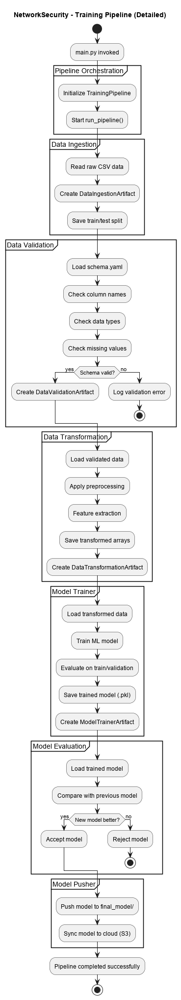
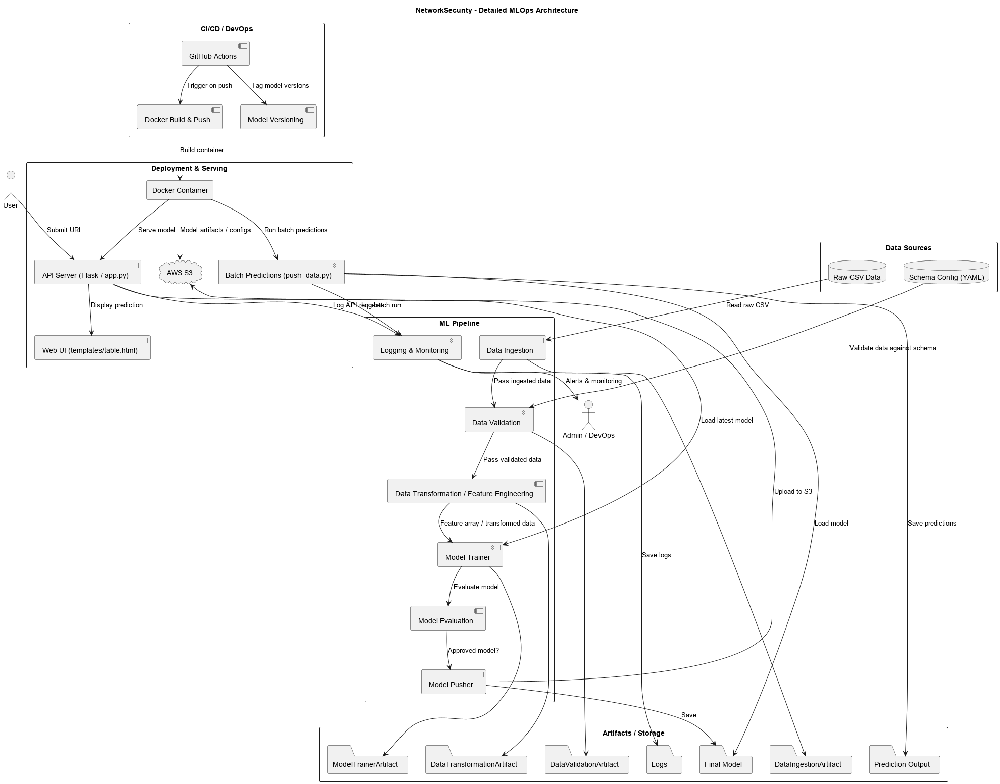
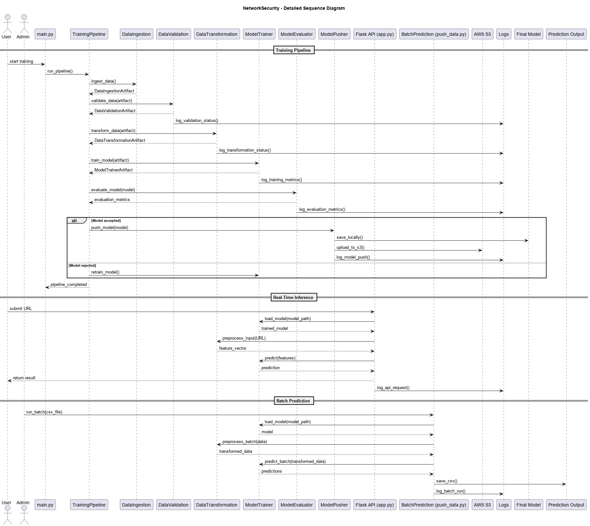
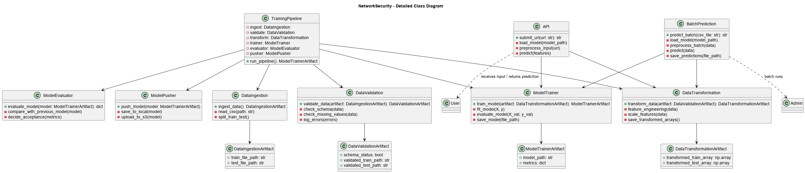

# 🔒 Phishing URL Detection System

An end-to-end **Machine Learning project** for detecting phishing URLs, built with **modular pipelines**, **MLOps best practices**, and **deployment support**.  
The system automates the entire ML lifecycle — **data ingestion, validation, transformation, training, evaluation, and prediction** — and serves predictions through a web app and batch pipeline.

---

## 🚀 Features
- **Automated Data Pipeline**
  - Ingestion of raw phishing dataset
  - Schema validation (`data_schema/schema.yaml`)
  - Drift detection with reports (`report.yaml`)
- **Data Transformation**
  - Preprocessing with NumPy arrays
  - Serialized preprocessing object (`preprocessing.pkl`)
- **Model Training**
  - Trains, tunes, and evaluates ML models
  - Final trained model saved in `final_model/model.pkl`
- **Batch Prediction**
  - Predicts on new CSV files → outputs stored in `prediction_output/output.csv`
- **Web Application**
  - Flask/FastAPI app (`app.py`) with simple UI (`templates/table.html`)
- **MLOps Support**
  - Logging (`logs/`)
  - Exception handling
  - GitHub Actions CI/CD (`.github/workflows/main.yml`)
  - Containerization with Docker (`Dockerfile`)
  - AWS S3 synchronization for artifacts (`networksecurity/cloud/s3_syncer.py`)

---

## 📂 Project Structure
```plaintext
├── app.py                 # Web app for predictions
├── main.py                # Entry point for training pipeline
├── push_data.py           # Utility to push new data
├── data_schema/schema.yaml
├── final_model/           # Trained model + preprocessor
├── prediction_output/     # Batch prediction outputs
├── Artifacts/             # Versioned pipeline artifacts
├── networksecurity/
│   ├── components/        # Ingestion, validation, transformation, training
│   ├── pipeline/          # Training & batch pipelines
│   ├── utils/             # Metrics & ML utilities
│   ├── cloud/             # AWS S3 sync
│   ├── logging/           # Custom logging
│   ├── exception/         # Error handling
│   └── constant/          # Configs & constants
├── templates/table.html    # Simple web UI
├── logs/                  # Pipeline and app logs
├── requirements.txt       # Python dependencies
├── Dockerfile             # Containerization
├── setup.py               # Package setup
├── README.md              # Documentation
├── docs/diagrams/         # UML diagrams (source + PNG)
│   ├── flow.uml
│   ├── flow.png
│   ├── architecture.uml
│   ├── architecture.png
│   ├── seq.uml
│   ├── seq.png
│   ├── class.uml
│   └── class.png
└── .github/workflows/     # CI/CD pipelines
## 📊 UML Diagrams

### 1️⃣ Flow Diagram
- UML source: [flow.uml](docs/diagrams/flow.uml)  
- Rendered diagram:  


### 2️⃣ Architecture Diagram
- UML source: [architecture.uml](docs/diagrams/architecture.uml)  
- Rendered diagram:  


### 3️⃣ Sequence Diagram
- UML source: [seq.uml](docs/diagrams/seq.uml)  
- Rendered diagram:  


### 4️⃣ Class Diagram
- UML source: [class.uml](docs/diagrams/class.uml)  
- Rendered diagram:  

