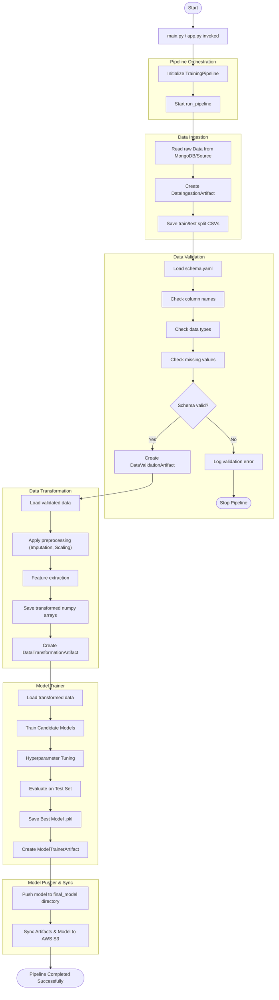

# 🔒 Network Security: Phishing URL Detection System


## 📖 Overview
The **Network Security Phishing Detection System** is an end-to-end Machine Learning project designed to identify and classify phishing URLs. Built with a focus on MLOps best practices, modularity, and scalability, this system automates the entire machine learning lifecycle—from data ingestion to deployment.

It features a robust **Training Pipeline** that handles data validation, transformation, and model training, alongside a **Prediction Pipeline** served via a FastAPI web application for real-time and batch predictions.

---

## 🚀 Key Features

*   **Modular Architecture:** Code is organized into independent components (Ingestion, Validation, Transformation, Training) for easy maintenance and testing.
*   **Automated Data Pipeline:**
    *   **Ingestion:** Fetches data from MongoDB/CSV sources and splits it into training/testing sets.
    *   **Validation:** Rigorously checks data against a defined schema (`schema.yaml`) to ensure data quality.
    *   **Transformation:** Handles missing values, encodes categorical features, and scales numerical data.
*   **Model Management:**
    *   Trains multiple models (e.g., Random Forest, Decision Tree, Logistic Regression, AdaBoost).
    *   Evaluates models based on accuracy, precision, recall, and F1-score.
    *   Selects the best performing model automatically.
*   **MLOps Integration:**
    *   **Experiment Tracking:** Uses MLflow/Dagshub for tracking experiments (configurable).
    *   **Artifact Management:** Syncs trained models and artifacts to AWS S3.
    *   **Containerization:** Fully Dockerized for consistent deployment.
    *   **CI/CD:** GitHub Actions workflows for continuous integration and deployment.
*   **Web Interface:** A user-friendly web app built with FastAPI and Jinja2 templates to upload CSV files and view prediction results.

---

## 🏗️ System Architecture & Flow

The following diagram illustrates the detailed flow of the Training Pipeline:



---

## 🧩 Component Details

### 1. Data Ingestion (`networksecurity/components/data_ingestion.py`)
Responsible for exporting data from the source (e.g., MongoDB) into a feature store (local artifacts). It performs the train-test split to ensure no data leakage occurs during training.

### 2. Data Validation (`networksecurity/components/data_validation.py`)
Validates the ingested data against the `data_schema/schema.yaml` file. It checks for:
*   Number of columns.
*   Column names.
*   Data types.
*   Drift detection (changes in data distribution over time).

### 3. Data Transformation (`networksecurity/components/data_transformation.py`)
Prepares the data for the model.
*   **Imputation:** Fills missing values (e.g., using KNNImputer).
*   **Handling Imbalance:** techniques to handle class imbalance if necessary.
*   **Serialization:** Saves the preprocessing object (`preprocessor.pkl`) for use during inference.

### 4. Model Trainer (`networksecurity/components/model_trainer.py`)
*   Iterates through a dictionary of models and hyperparameters.
*   Trains models and calculates metrics.
*   Selects the model with the best score on the test dataset.
*   Saves the final model (`model.pkl`).

---

## 🛠️ Installation & Setup

### Prerequisites
*   Python 3.8+
*   MongoDB Atlas Account (or local MongoDB)
*   AWS Account (for S3 artifact storage, optional)

### 1. Clone the Repository
```bash
git clone https://github.com/yourusername/networksecurity.git
cd networksecurity
```

### 2. Create a Virtual Environment
```bash
conda create -p venv python=3.10 -y
conda activate ./venv
# OR using venv
python -m venv venv
source venv/bin/activate  # On Windows: venv\Scripts\activate
```

### 3. Install Dependencies
```bash
pip install -r requirements.txt
```

### 4. Configure Environment Variables
Create a `.env` file in the root directory and add the following:
```env
MONGODB_URL_KEY="mongodb+srv://<username>:<password>@cluster0.mongodb.net/..."
AWS_ACCESS_KEY_ID="your_aws_access_key"
AWS_SECRET_ACCESS_KEY="your_aws_secret_key"
AWS_DEFAULT_REGION="us-east-1"
```

---

## 💻 Usage

### Running the Web Application
To start the FastAPI server for the user interface and API endpoints:
```bash
python app.py
```
Open your browser and navigate to: `http://localhost:8000`

### Training the Model
You can trigger the training pipeline via the web UI (typically `/train` endpoint) or by running the standalone script:
```bash
python main.py
```

### Making Predictions
1.  Go to the web interface.
2.  Upload a CSV file containing URL features.
3.  Click **Predict**.
4.  The results will be displayed in a table and saved to `prediction_output/output.csv`.

---

## 📁 Project Structure
```plaintext
networksecurity/
├── .github/workflows/      # CI/CD configurations
├── data_schema/            # Data validation schema
├── docs/                   # Documentation and diagrams
├── final_model/            # Production-ready model & preprocessor
├── logs/                   # Execution logs
├── networksecurity/        # Main Source Code
│   ├── cloud/              # Cloud syncing utilities
│   ├── components/         # ML Pipeline components (Ingestion, Validation, etc.)
│   ├── constant/           # Project constants
│   ├── entity/             # Data classes (Config & Artifacts)
│   ├── exception/          # Custom Exception handling
│   ├── logging/            # Logging configuration
│   ├── pipeline/           # Training and Prediction pipelines
│   └── utils/              # Helper functions
├── prediction_output/      # Stored predictions
├── templates/              # HTML templates for the UI
├── app.py                  # FastAPI Application entry point
├── Dockerfile              # Docker build configuration
├── main.py                 # Pipeline execution entry point
├── requirements.txt        # Python dependencies
└── setup.py                # Package installation setup
```

## 🐳 Docker Support

Build the Docker image:
```bash
docker build -t networksecurity .
```

Run the container:
```bash
docker run -p 8000:8000 networksecurity
```

## 🤝 Contributing
Contributions are welcome! Please create a new branch for your feature and submit a Pull Request.

## 📄 License
This project is licensed under the MIT License.